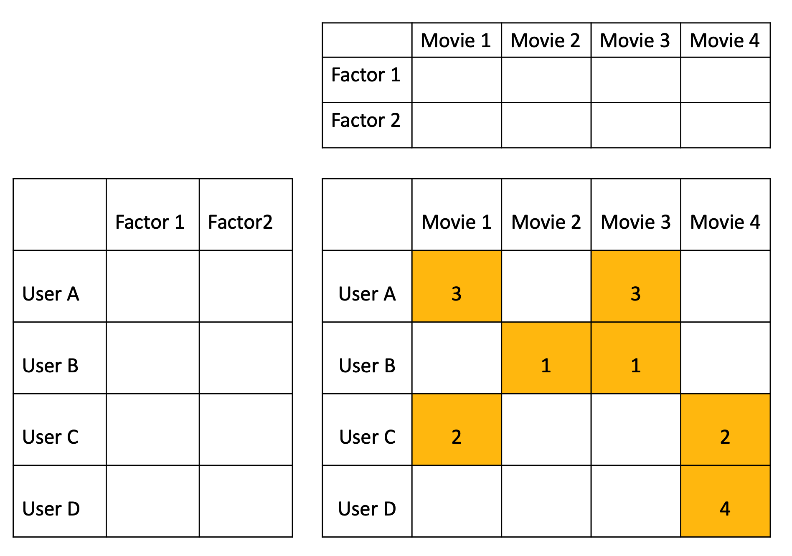
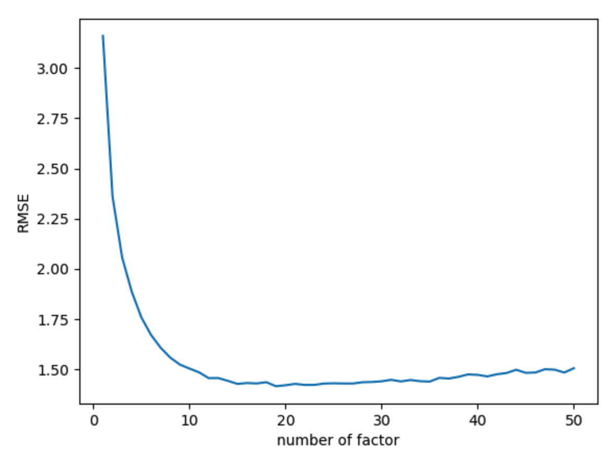
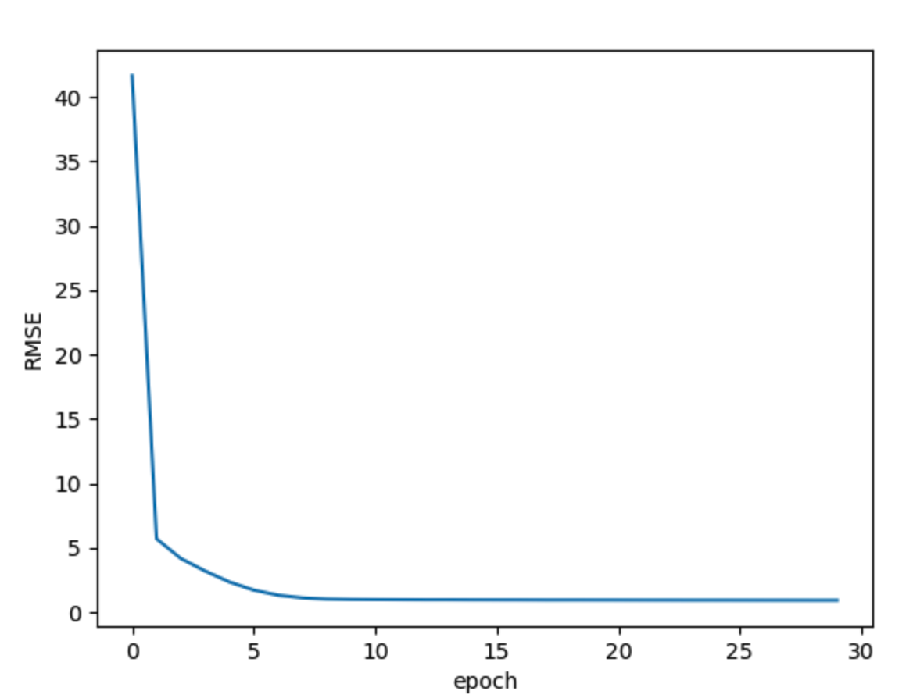

### MFML (Matrix Factorization MovieLens in torch)
This repository is implementation about [Matrix Factorization Techniques for Recommender Systems](https://datajobs.com/data-science-repo/Recommender-Systems-[Netflix].pdf)

### Dataset

- Recommendation System 분야의 journal, conference 논문들과 State-of-the-Art 논문들에서 bench mark dataset으로 MovieLens Dataset을 이용한다. MovieLens dataset은 userId, movieId, rating, timestamp, tag, title, genres 등을 포함한 column들로 이뤄져 있다. column들 중 userId, movieId, rating, timestamp으로 이루어져 있는 ratings.csv 파일을 활용한다.  100k크기의 dataset기준으로, user는 610명, movie는 9742개, rating은 100836개로 dataset이 구성되어 있다. MovieLens 데이터는 기본적으로 user-based dataset으로, 각 user마다 최소 20개의 movie에 대해 평가를 한 user들만 포함되어 있다.  file size는 100k, 1M부터 최대 20M까지 있다.

### Model explanation

<p align="center">
<div class="center">
  <figure>
    <a href="/images/matrix.png"></a>
  </figure>
</div>
</p>

- Matrix Factorization Techniques for Recommender Systems 논문을 기반으로 Matrix Factorization 모델을 구현하였다.
- Matrix Factorization model은 user-item interaction에 대해 latent factor들을 inner product(dot product)하여 target에 대한 Matrix를 완성시킨다. Implicit feedback, explicit feedback을 모두 고려하여 MF를 구현할 수 있고, 해당 task에서는 explicit feedback 만을 고려하여 모델을 학습시켰다.

- 해당 task는 feature들을 dot product한 것 이외에도, 논문에서 설명한 bias와 confidence score라는 항을 prediction에 추가하였다.
   - bias항은 특정 user 혹은 특정 item에 대한 rating의 편향성이 모델에 포함되지 않게 하기 위해 추가하였다.
   - 논문에서 설명한 confidence score는 해당 user가 얼마나 신뢰성 있는지 나타내는 지표로, user마다 rating한 빈도수로도 판단할 수 있다.

   해당 수식은 bias, confidence score 항들을 추가한 cost function입니다. cost function으로 RSME(Root Squared Mean Error)를 사용하였다.

### Matrix Factorization model directory tree

```python
.
├── dataset
├── evaluation.py
├── main.py
├── model
│   └── MF.py
├── optimize.py
├── train.py
└── utils.py
```

### Quick start

```python
python main.py -e 30 -b 32 -f 30 -lr 0.001 -down True
```

## Matrix Factorization Result

| MovieLens 100K | average cost(RMSE) | epoch | # latent factor |
| --- | --- | --- | --- |
| Matrix Factorization | 0.9108 | 30 | 30 |
| Matrix Factorization with confidence score | 0.9242 | 30 | 30 |
| Matrix Factorization with bias | 0.9668 | 30 | 30 |
| Matrix Factorization with confidence score and bias | 1.4973 | 30 | 30 |


factor개수가 19에서 가장 좋은 성능을 보였다.

<p align="center">
<div class="center">
  <figure>
    <a href="/images/optimize_graph.png"></a>
  </figure>
</div>
</p>


epoch =30, batch=32, learning rater = 0.001, best factor =19일 때의 epoch별 RMSELoss.

<p align="center">
<div class="center">
  <figure>
    <a href="/images/loss_curve.png"></a>
  </figure>
</div>
</p>


reference : [Matrix Factorization Techniques for Recommender Systems](https://datajobs.com/data-science-repo/Recommender-Systems-[Netflix].pdf)
review written in korean : [Review](https://changhyeonnam.github.io/2021/12/21/Matrix_Factorization.html)

Matrix Factorization with MovieLens in torch
